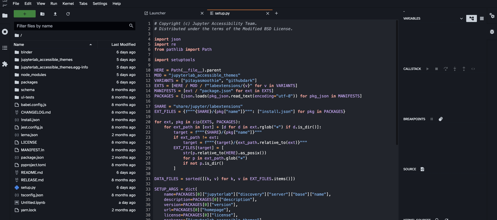

# GitHub Dark

A theme heavily inspired by the [`GitHub Dark default theme` for VSCode](https://github.com/primer/github-vscode-theme).

## Usage ✨

To enable the theme from the JupyterLab menu bar. Go to `Settings -> JupyterLab Theme -> Github Dark`

## Colors

All the colors used for text in the theme are conformant with [WCAG 2.1 contrast standards](https://www.w3.org/WAI/WCAG21/Understanding/contrast-minimum.html).

Background color:  `#ffffff`

Highlight color:  `#321f7ad9`

**WCAG conformance**

All the colors in the table shown were tested with the background color.

| Color                                                        | Hex       | Ratio    | Normal text | Large text |
| ------------------------------------------------------------ | --------- | -------- | ----------- | ---------- |
|  | `#1F2328` | 15.8 : 1 | AAA         | AAA        |
|  | `#6e7781` | 4.5 : 1  | AA          | AAA        |
|  | `#57606a` | 6.4 : 1  | AA          | AAA        |
|  | `#424a53` | 9.0 : 1  | AAA         | AAA        |
|  | `#32383f` | 11.8 : 1 | AAA         | AAA        |
|  | `#24292f` | 14.7 : 1 | AAA         | AAA        |
|  | `#0550ae` | 7.6 : 1  | AAA         | AAA        |
|  | `#0a3069` | 12.8 : 1 | AAA         | AAA        |
|  | `#116329` | 7.4 : 1  | AAA         | AAA        |
|  | `#953800` | 7.4 : 1  | AAA         | AAA        |
|  | `#a40e26` | 7.9 : 1  | AAA         | AAA        |
|  | `#6639ba` | 7.3 : 1  | AAA         | AAA        |

## Font

This theme is using the [Atkinson Hyperlegible font](https://brailleinstitute.org/freefont), which focuses on letterform distinction to increase character recognition, ultimately improving readability.

This font can only be changed for the `Markdown viewer` and the `Terminal`. You will need to make these changes from the `Advanced settings` editor in the JupyterLab UI:

1. Select the `Settings` option in the `menu bar`.
2. Go to `Markdown viewer settings`, and type the font family that you want to use.
3. To change the `Terminal` font, scroll down to `Terminal settings` and type the name of the font family.

## Screenshots

## Acknowledgements

This theme is based on and inspired by the [`GitHub Light Default` theme for VSCode](https://github.com/primer/github-vscode-theme)
