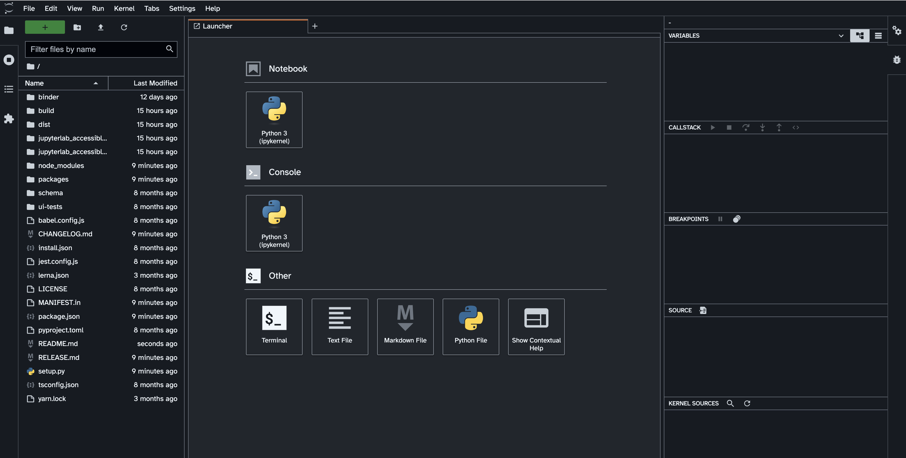

# GitHub Dark

A theme heavily inspired by the [`GitHub Dark default theme` for VSCode](https://github.com/primer/github-vscode-theme).

## Usage ✨

To enable the theme from the JupyterLab menu bar. Go to `Settings -> JupyterLab Theme -> Github Dark`

## Colors

All the colors used for text in the theme are conformant with [WCAG 2.1 contrast standards](https://www.w3.org/WAI/WCAG21/Understanding/contrast-minimum.html).

Background color:  `#21262d`

Highlight color:  `#e3b341`

**WCAG conformance**

All the colors in the table shown were tested with the background color.

| Color                                                        | Hex       | Ratio    | Normal text | Large text |
| ------------------------------------------------------------ | --------- | -------- | ----------- | ---------- |
|  | `#ffffff` | 15.2 : 1 | AAA         | AAA        |
|  | `#ffa198` | 7.8 : 1  | AAA         | AAA        |
|  | `#56d364` | 7.9 : 1  | AAA         | AAA        |
|  | `#d2a8ff` | 7.8 : 1  | AAA         | AAA        |
|  | `#ffa657` | 7.9 : 1  | AAA         | AAA        |
|  | `#b1bac4` | 7.7 : 1  | AAA         | AAA        |
|  | `#79c0ff` | 7.8 : 1  | AAA         | AAA        |

## Font

This theme is using the [Atkinson Hyperlegible font](https://brailleinstitute.org/freefont), which focuses on letterform distinction to increase character recognition, ultimately improving readability.

This font can only be changed for the `Markdown viewer` and the `Terminal`. You will need to make these changes from the `Advanced settings` editor in the JupyterLab UI:

1. Select the `Settings` option in the `menu bar`.
2. Go to `Markdown viewer settings`, and type the font family that you want to use.
3. To change the `Terminal` font, scroll down to `Terminal settings` and type the name of the font family.

## Screenshots

## Acknowledgements

This theme is based on and inspired by the [`GitHub Dark Default` theme for VSCode](https://github.com/primer/github-vscode-theme)
