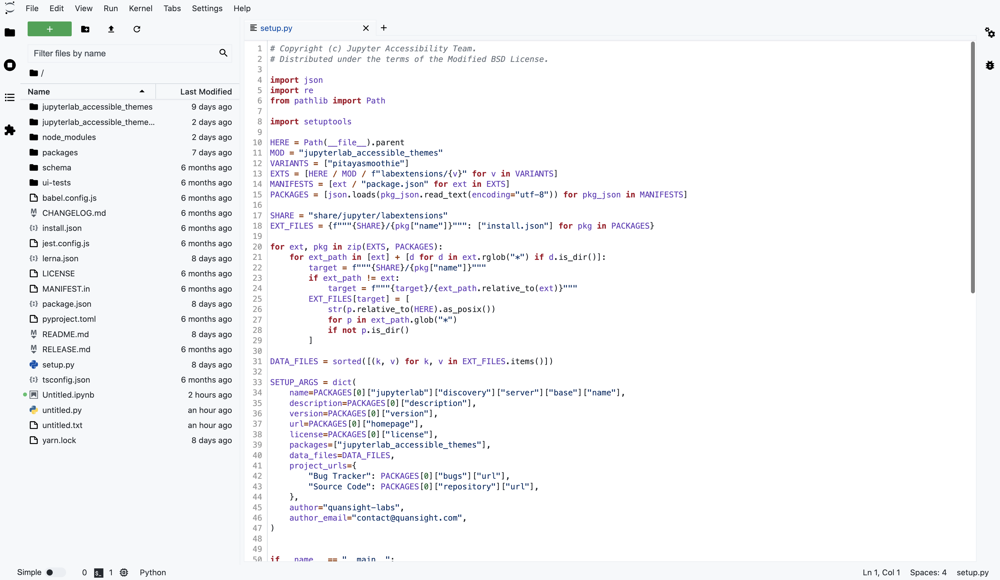

# Github Light

## Usage ✨

To enable the theme in JupyterLab: `Go to Settings -> JupyterLab Theme -> Github Light`

To enable the theme's scrollbars please navigate to `Settings -> Advanced Settings Editor -> Theme` then enable the checkbox `Scrollbar Theming`.

## Colors

All the colors used for text in the theme are compliant with [WCAG 2.1 standards](https://www.w3.org/TR/UNDERSTANDING-WCAG20/visual-audio-contrast-contrast.html).

Background color:  `#181036`

Highlight color:  `#321f7ad9`

**WCAG compliance**

| Color                                                        | Hex       | Ratio    | Normal text | Large text |
| ------------------------------------------------------------ | --------- | -------- | ----------- | ---------- |
|  | `#f7f7f7` | 16.8 : 1 | AAA         | AAA        |
|  | `#37e0e0` | 11.1 : 1 | AAA         | AAA        |
|  | `#1abec2` | 7.9 : 1  | AAA         | AAA        |
|  | `#9dbcf6` | 9.4 : 1  | AAA         | AAA        |
|  | `#aabdf7` | 9.7 : 1  | AAA         | AAA        |
|  | `#7998f2` | 6.5 : 1  | AA          | AAA        |
|  | `#b683fc` | 6.6 : 1  | AA          | AAA        |
|  | `#a56cf5` | 5.2 : 1  | AA          | AAA        |
|  | `#8b81b0` | 5.0 : 1  | AA          | AAA        |
|  | `#f38672` | 7.3 : 1  | AAA         | AAA        |
|  | `#f45c7b` | 5.7 : 1  | AA          | AAA        |
|  | `#ffe46b` | 14.2 : 1 | AAA         | AAA        |

## Screenshots

## Acknowledgements

