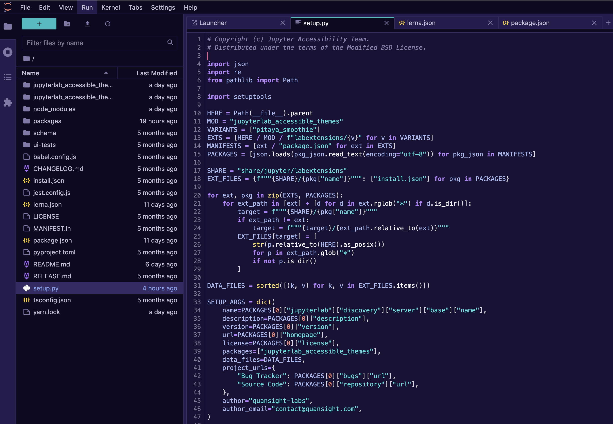

# Pitaya Smoothie

A professional JupyterLab theme with hand-picked & bold colors for JupyterLab. The theme is heavily inspired by the [Pantone colour of the year 2018](https://www.pantone.com/articles/color-of-the-year/color-of-the-year-2018) and the Outrun aesthetics. However, colors are on the pastel side to help provide contrast and highlight what is essential. Color choices have taken into consideration what is accessible to people with colorblindness and in low-light circumstances.

For more details about the core theme colors and the such check out the main theme repository: <https://github.com/trallard/pitaya_smoothie>.

- [Pitaya Smoothie](#pitaya-smoothie)
  - [Use ✨](#Use-)
  - [Colors](#colors)
    - [WCAG conformance](#wcag-conformance)
  - [Font](#font)
  - [Screenshots](#screenshots)
  - [Acknowledgements](#acknowledgements)

## Use ✨

To enable the theme in JupyterLab: `Go to Settings -> JupyterLab Theme -> Pitaya Smoothie`

To enable the theme's scrollbars navigate to `Settings -> Advanced Settings Editor -> Theme` then enable the checkbox `Scrollbar Theming`.

## Colors

All the colors used for text in the theme are compliant with [WCAG 2.1 standards](https://www.w3.org/TR/UNDERSTANDING-WCAG20/visual-audio-contrast-contrast.html) , against the following colours:

- Background color:  `#181036`
- Highlight color:  `#321f7ad9`

### WCAG conformance

| Color                                                        | Hex       | Ratio    | Normal text | Large text |
| ------------------------------------------------------------ | --------- | -------- | ----------- | ---------- |
|  | `#f7f7f7` | 16.8 : 1 | AAA         | AAA        |
|  | `#37e0e0` | 11.1 : 1 | AAA         | AAA        |
|  | `#1abec2` | 7.9 : 1  | AAA         | AAA        |
|  | `#9dbcf6` | 9.4 : 1  | AAA         | AAA        |
|  | `#aabdf7` | 9.7 : 1  | AAA         | AAA        |
|  | `#7998f2` | 6.5 : 1  | AA          | AAA        |
|  | `#b683fc` | 6.6 : 1  | AA          | AAA        |
|  | `#a56cf5` | 5.2 : 1  | AA          | AAA        |
|  | `#8b81b0` | 5.0 : 1  | AA          | AAA        |
|  | `#f38672` | 7.3 : 1  | AAA         | AAA        |
|  | `#f45c7b` | 5.7 : 1  | AA          | AAA        |
|  | `#ffe46b` | 14.2 : 1 | AAA         | AAA        |

## Font

This theme is using the [Atkinson Hyperlegible font](https://brailleinstitute.org/freefont), which focuses on letter form distinction to increase character recognition, ultimately improving readability.

This font can only be changed for the `Markdown viewer` and the `Terminal`. You will need to make these changes from the `Advanced settings` editor in the JupyterLab UI:

1. Select the `Settings` option in the `menu bar`.
2. Go to `Markdown viewer settings`, and type the font family that you want to use.
3. To change the `Terminal` font, scroll down to `Terminal settings` and type the name of the font family.

## Screenshots

## Acknowledgements

This theme is based and inspired in [VS Code theme extension for Pitaya Smoothie](https://github.com/trallard/pitaya_smoothie).
